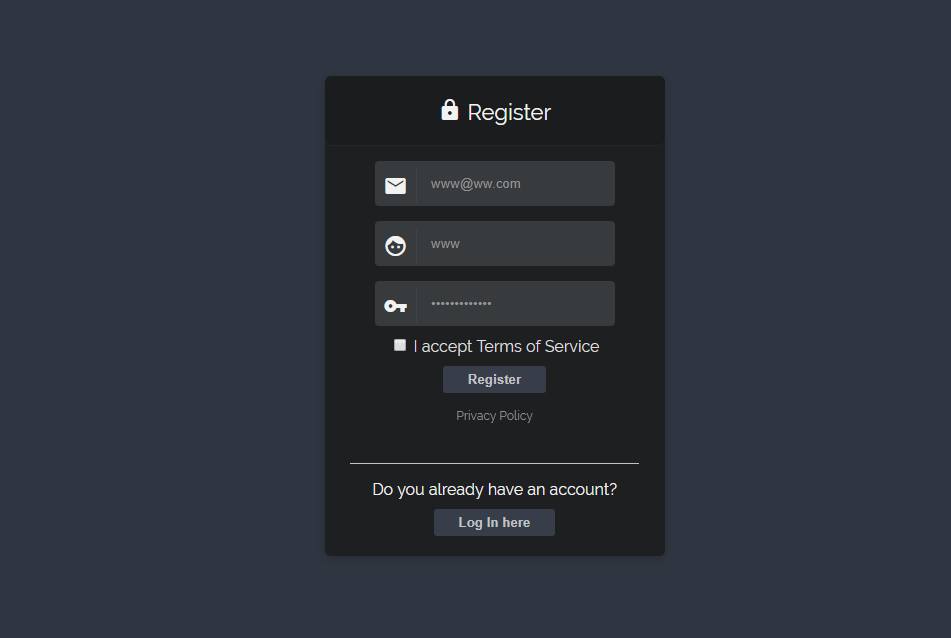

# PHP Backend with firebase

This is a php laravel sample integrated with firebase as the backend database
This supports user authentication with email and password

<h3 align="center">

</h3>

## Getting Started

To get started and run the app, you need to follow these simple steps:

1. Clone the app[itdevstar](https://github.com/MobileDevStar/FireBackEnd_php).
2. Go to [Firebase Console](https://console.firebase.google.com), create your project.
3. After successfully building the project, move to the Database tab, tick Rules to update read and write rules to true and then press the Publish button.
4. Create an API key for your project.Go to Project settings >>  SERVICE ACCOUNTS.
5. Download "Google-Service-account.json" file and add to the project.
6. paste into app >>  Http >> Controllers.
7. command "php artisan serve"
8. Go to this URL: http://localhost:8000/signup

## Compatibility

This project is written in Laravel5.8 and requires >= Php7.0 and Local SSL Setting.

## Author

* [ITDevstar]

## License

Copyright 2019 ITDevStar.

Licensed under MIT License: https://opensource.org/licenses/MIT
